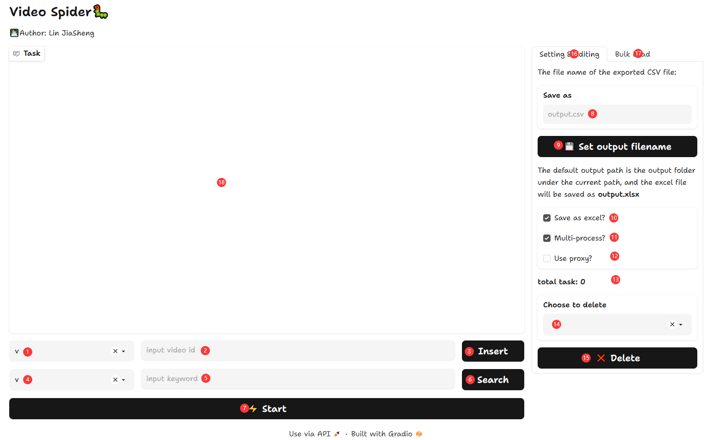

# Video Spider

- 目录

​	[文件结构](#文件结构)

​	[程序依赖](#程序依赖)

​	[添加需要爬取的视频](#添加需要爬取的视频)

​	[运行程序](#运行程序)


## 文件结构

```
.
│  GUI.py
│  main.py
│  README.md
│  requirements.txt
│  Spider.py
│  WebClass.py
│
├─assets
│      favicon.ico
│
└─config
        config.json
        VideoList.json
```

- `main.py`为入口程序，`Spider.py`为爬虫主程序，`WebClass.py`为网站类，设置获取网站URL、动态内容等的方法，`gui.py`为Web GUI
- `assets`文件夹中的文件用于Web GUI的图标显示及README的图片显示
- `config.json`为针对各类网站的基本设置，`VideoList.json`为默认的带爬取视频配置文件


## 程序依赖

- 本程序的python库依赖如下，已经包含在`requirements.txt`中，可以使用 `python -m pip install -r requirements.txt` 进行安装。

```
fake_useragent==1.1.1
gradio==3.24.1
lxml==4.9.1
pandas==1.5.3
requests==2.28.2
tqdm==4.65.0
```

- 此外，若要使用该爬虫程序爬取以HLS协议传输的视频文件（cctv和tudou），**还需要安装`ffmpeg`。**


## 添加需要爬取的视频

- 在`VideoList.json`文件中新增关于要爬取视频的信息，包括：`web_id`：该视频在哪个视频网站；`video_id`：该视频的id。`web_id`与实验文档中视频网站的对应关系如下表所示。

| `web_id`   | 对应网站的网址     |
| ---------- | ------------------ |
| `v`        | `v.baidu.com`      |
| `ifeng`    | `v.ifeng.com`      |
| `ku6`      | `www.ku6.com`      |
| `haokan`   | `haokan.baidu.com` |
| `thepaper` | `www.thepaper.cn`  |
| `tudou`    | `www.tudou.com`    |
| `cctv`     | `tv.cntv.cn`       |

- 添加的信息的格式为：`[{"web_id":"v","video_id":"123"},{"web_id":"thepaper","video_id":"456"}]`。在`./config/VideoList.json`中有示例。
  - **注意：**对于央视视频，video_id不需要包括第一个**”E”**。
    - 如：`https://v.cctv.com/2023/03/08/VIDE0HSVGjv2O7TRj4ZwS79r230308.shtml`，则其对应的vid为`0HSVGjv2O7TRj4ZwS79r230308`。

- 需要说明的一点是，部分网站打开后会重定向至其它网站，或该网站的视频板块使用了其它的`url`，因此在`config.json`中部分网站的`url`与实验文档中给出的不符。
- 除了通过`VideoList.json`之外，**还可以使用[Web GUI](#WebGUI)的方式来添加需要爬取的视频**。


## 运行程序

### 命令行

- 使用下列命令运行本程序：

  ```shell
  python main.py -t/--task <task> -e -o/--output <output> -d/--dir <dir> -s/--search <web_id>:<keyword>|<web_id>:<keyword>... --multi_process
  ```

- 程序会将爬取到的视频标题等信息存放在`video.csv`文件中，将爬取到的视频文件存放在`./file`中。其中，以HLS协议传输的视频文件将存放在`./file/hls`下，其它视频文件将存放在`./file/mp4`文件夹下。视频文件将以`web_id+video_id+video_title`的形式命名。


- 配置文件在`./config/config.json`。


- 命令行参数的解释如下表：


| 参数              | 作用                                                         | 备注                                                   |
| ----------------- | ------------------------------------------------------------ | ------------------------------------------------------ |
| `-t` /`--task`    | 指定描述要爬取视频的文件，默认为`./config/VideoList.json`    |                                                        |
| `-e`              | 指定是否要生成excel文件，若要生成则会在输出目录下生成`output.xlsx`文件 |                                                        |
| `-o`/`--output`   | 指定输出`.csv`文件的名字，要求带后缀，默认为`output.csv`     |                                                        |
| `-d`/`--dir`      | 指定输出目录，默认为`./output`                               |                                                        |
| `-s/--search`     | 指定根据关键词搜索并选取前10个视频                           | 支持搜索的web id有**haokan**、**thepaper**和**cctv**。 |
| `--multi_process` | 多进程爬取                                                   | 将会开启4个进程进行爬取                                |

### WebGUI

- 本程序还提供了Web GUI，使用下列命令以通过Web GUI来使用本程序：

  ```shell
  python main.py -g/--gui -p/--port <port>
  ```

  | 参数        | 作用                                   |
  | ----------- | -------------------------------------- |
  | `-g/--gui`  | 使用Web GUI                            |
  | `-p/--port` | 指定Web GUI的端口，不指定则默认为12345 |

  需要注意的是，若指定了`-g/--gui`选项，则会忽略除`-p/--port`外的所有命令行参数；此外，若没有指定`-g/--gui`选项，则`-p/--port`选项会被忽略。

- Web GUI如下图所示。

  
  
  | 编号    | 说明                                                         |
  | ------- | ------------------------------------------------------------ |
  | 1，2，3 | 用于手动手动输入video id，1 选择Web id，2 手动输入，点击3 Insert键插入一条待爬取的记录 |
  | 4，5，6 | 用于关键词搜索功能，4 选择Web id，5 输入要搜索的关键词，6 Search开始搜索 |
  | 7       | 开始按钮，根据已输入的带爬取记录开始爬取视频相关信息         |
  | 8，9    | 设置输出的csv文件的文件名，8处填新的文件名，点击 9 设置      |
  | 10      | 选择是否同时输出xlsx文件                                     |
  | 11      | 用来选择是否以多进程模式进行爬取                             |
  | 12，13  | 用于移除带爬取记录中的记录，11 选择，点击12 即可删除11中选中的记录 |
  | 13及14  | Tab切换，13用于进行各类设置和编辑，14用于批量导入带爬取记录  |
  | 15      | 用于显示带爬取记录                                           |


## 程序输出

- 程序在运行时会在控制台打印一些与程序运行过程有关的输出以提供程序运行状态的信息；

- 程序将会在指定文件夹下生成记录了所爬取视频下列信息的csv文件和xlsx文件（如果指定了-e参数或在GUI中选中了对应选项）

  | 视频信息 | 备注 |
  | -------- | ---- |
  | 标题     |      |
  | 简介     |      |
  | 热力值   |      |
  | 点赞数   |      |
  | 播放量   |      |

- **注意：**csv文件是以utf-8编码保存的，若使用Microsoft Excel打开**可能会出现中文变成乱码的情况出现**，请使用**记事本**打开。

- 当有视频爬取失败时，会将爬取失败的视频的web id和video id打印在控制台中，并且在输出目录中生成记录该信息的`fail_log_<timestamp>.json`文件。

